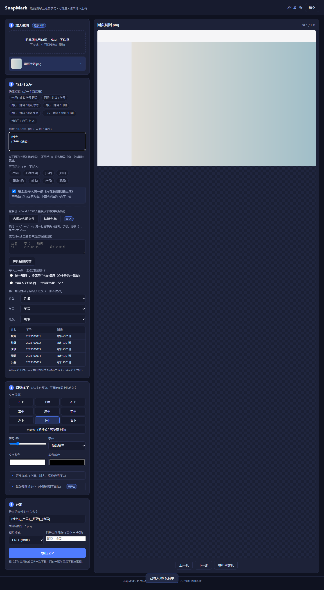
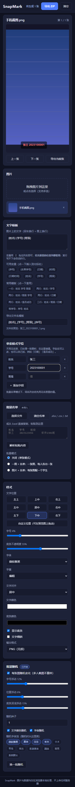

# SnapMark · 截图快注

<p align="center">
  <a href="https://wakeup595626-cmyk.github.io/SnapMark/">
    
  </a>
</p>

> **在线地址（免安装，点开即用）：<https://wakeup595626-cmyk.github.io/SnapMark/>**

> 批量给截图加水印信息（姓名 / 学号 / 班级 / 自定义变量），一键导出重命名好的 ZIP。
> **纯本地运行，图片不上传任何服务器。**



<p align="center">
  
</p>

---

## 为什么做这个

每次班级收集截图，都要把几十上百张图挨个打开、打字、改名、打包：

- 收健康打卡截图，要标上"姓名 + 学号"
- 收作业截图，要标上"班级 + 姓名 + 学号"
- 收活动签到，要按人分类打包

手工做一次半小时，还容易漏字、写错学号。**SnapMark 把这件事压缩成三步：拖图 → 填一次信息 → 导出 ZIP。**

## 功能

- **分步向导**：界面按「① 放图 → ② 写文字 → ③ 调样式 → ④ 导出」排列，第一次打开有 3 行说明，跟着做就行
- **批量导入**：拖拽或点击选择，支持一次上百张（PNG / JPG / WebP 等浏览器支持的所有格式）
- **花名册批量处理**：导入 Excel / CSV，或直接从 Excel 复制粘贴，一次性给全班每人出一张
- **通用文字模板**：不限定姓名/学号，**花名册里有什么列就能用什么变量**（`{日期}`、`{是否成功}`、`{手机号}`…）
- **多行文字**：模板里按回车就能分成两行、三行，写不下会自动折行
- **实时预览**：改任何设置立刻看到效果，不用反复导出试
- **九宫格定位 + 自定义位置**：既能一键放九宫格，也能拖滑杆 / 直接在预览图上按住拖动
- **字体可换**：微软雅黑、黑体、宋体、楷体、仿宋、等线、苹方、思源黑体、圆体、等宽等 11 种系统字体，另有字重、倾斜、左中右对齐
- **批量随机**：80 个人 80 张图，**字号、位置、深浅、字体、颜色各自随机**，看起来像不同人做的；随机结果由种子决定，同一批可复现，也能一键「换一批随机」
- **自动命名**：导出文件名同样支持模板，如 `2023100001-张三.png`，界面上有**文件名实时预览**
- **样式可调**：字号（按图片短边自适应，长图竖图都不会变形）、文字颜色、底条颜色、底条透明度
- **样式方案**：内置 4 套现成样式（默认 / 醒目黄字 / 无底条描边 / 红底白字），点一下整套套用；也能把当前调好的样子存成自己的方案，下次直接用
- **撤销 / 重做**：顶栏随时可撤销每一步调整（快捷键 Ctrl+Z / Ctrl+Y，最多 60 步），调坏了随时回去
- **导出进度**：批量导出时有进度条，逐张绘制和打包过程都看得见；只有一张时直接下载这张图，不再打成 ZIP
- **导出数量控制**：实时显示"将生成 N 张"，还能限制只导前 N 张
- **ZIP 打包**：一键导出全部，直接发群里
- **记忆上次填写**：同一批人连续处理不用重复输入
- **纯离线**：零后端、零上传、零追踪

## 批量处理全班（花名册）

这是最省事的功能：**80 个学生，不用手输 80 次**。

### 两种批量模式

| 模式 | 适用场景 | 说明 |
|---|---|---|
| **一图 × 名单** | 一张统一的底图（海报、证书、打卡界面），要发给全班每人 | 导入 1 张图 + N 人名单 → 生成 N 张 |
| **图片 × 名单** | 每个学生自己交了一张截图，需要给每张图打上**本人**信息 | 导入 N 张图 + N 人名单 → 生成 N 张 |

### 导入花名册的三种方式

1. **选择文件**：支持 `.xlsx`、`.xls`、`.csv`、`.txt`
2. **直接粘贴**：在 Excel 里选中姓名/学号/班级几列 → `Ctrl+C` → 粘贴到工具里 → 点「解析粘贴内容」
3. **手动填写**：人少的话，不开批量开关，直接在「这些信息填什么」里填

> 中文 Excel 直接导出的 CSV 是 GBK 编码，浏览器默认按 UTF-8 读会乱码。
> SnapMark 会自动识别并回退到 GBK 解码，所以两种编码都能正常导入。

### 列名自动识别

表头含「姓名 / 名字 / 学生姓名」「学号 / 学籍号 / 编号」「班级 / 班别 / 所在班级」会自动对应。
识别不准时，可以在「列的对应关系」里手动指定。表里**多余的列也能当变量用**，
比如表里有「手机号」这一列，模板里写 `{手机号}` 一样会被替换。

### 图片与学生的对应方式

- **按顺序一一对应**：图片按导入顺序，与名单第 1、2、3…行依次配对
- **按文件名匹配**：文件名里含**姓名或学号**就自动认领。例如 `钱芳.png`、
  `2023100001_钱芳.jpg` 都能匹配上。匹配不上会明确提示，不会静默出错

### 关于 `{序号}`

导出序号会**自动补零**到总人数的位数：生成 80 张时是 `01`…`80`，
这样在文件管理器里按名称排序不会出现 `1, 10, 11, 2` 的错乱。

## 使用

### 方式一：在线使用

**<https://wakeup595626-cmyk.github.io/SnapMark/>**

打开即用，无需安装任何东西。所有图片处理都在你自己的浏览器里完成，图片和名单不会上传到任何服务器。

### 方式二：本地使用（推荐，更快更私密）

下载仓库后直接双击 `index.html` 即可，无需安装任何环境。

### 方式三：本地服务器

```bash
# 任意静态服务器都可以
npx serve .
# 或
python -m http.server 8080
```

## 使用步骤

界面按 **1 2 3 4** 四个步骤从上往下排，照着做就行：

| 步骤 | 做什么 |
|---|---|
| **① 放入截图** | 把截图拖进虚线框，或点一下选择（可多选） |
| **② 写上什么字** | 选一个快捷模板，或自己写；点小标签就能插入变量 |
| **③ 调整样子** | 位置、字号、字体、颜色，右边实时预览，可直接拖动文字 |
| **④ 导出** | 确认「导出 ZIP」，只有一张时直接下载 |

第一次打开会有一个三行说明的欢迎窗口，关掉后不再弹出。

### 只处理自己的一两张图

第 ② 步里的「**给全班每人做一张**」开关保持关闭，直接在「这些信息填什么」里把
`{姓名}`、`{学号}` 等填成真实内容，然后到第 ④ 步导出。

1. 把截图拖进左侧"图片"区域
2. 在「图片上的文字」里写要印在图上的内容（回车 = 换行），在下面填对应值
3. 按需调整位置（可拖动）、字体、字号、颜色
4. 点第 ④ 步的**导出 ZIP**，浏览器会下载一个打包好的压缩包

### 全班批量（花名册）

1. 第 ② 步打开「**给全班每人做一张（用花名册批量生成）**」开关
2. 会被自动请去选一份花名册（Excel / CSV），也可以把 Excel 名单直接粘贴进去
3. 选择对应方式：**同一张图**（交全班统一截图）或**我导入了好多图**（每张图各配一个人）
4. 第 ① 步放入图片（"同一张图"模式只需 1 张底图）
5. 右上角会显示「将生成 N 张」，确认后到第 ④ 步点**导出 ZIP**

> 打开批量开关后，手动填的那些字段会自动收起、以花名册为准；关掉开关又会回来。
> 第 ③ 步的「更多样式」和「每张图随机变化」默认折叠起来，需要时点一下展开。

## 文字模板说明

默认模板：`{姓名} {学号} {班级}`

### 变量从哪来

规则只有一条：**花名册里那列叫什么，模板里就写什么**。

| 变量 | 含义 | 示例 |
|---|---|---|
| `{序号}` | 当前这张图的序号（自动补零） | 01、02、03 |
| `{名单序号}` | 在花名册里的第几行（从 1 开始） | 1、2、3 |
| `{日期}` | 今天的日期 | 2026-10-04 |
| `{时间}` | 当前时间 | 15:20 |
| `{日期时间}` | 日期 + 时间 | 2026-10-04 15:20 |
| `{姓名}` | 姓名 | 张三 |
| `{学号}` | 学号 | 2023123456 |
| `{班级}` | 班级 | 软件2301班 |

除了上面这些，**花名册里的每一列都能当变量**。比如表头是「手机号」「是否成功」「宿舍号」，
模板里直接写 `{手机号}` `{是否成功}` `{宿舍号}` 就行，不需要任何设置。

「可用变量」那一排标签会根据当前花名册动态生成，点一下就能插到光标处，不用手打。

### 一行、两行、三行

模板框里**按回车就是图上换行**：

```
{姓名}
{日期} {是否成功}
```

上面这段会画成两行。某一行的文字太长时，SnapMark 会自动折到下一行（最多 8 行）。

### 手动填写的字段

不用花名册、只处理一张图时，在「这些信息填什么」里直接填值。
字段名可以改（比如改成「日期」「是否成功」），也可以点「＋ 添加字段」自己加任意多个。

### 导出文件名模板

默认：`{姓名}_{学号}_{班级}_{序号}`

变量规则和文字模板完全一样，例如改成 `{学号}-{姓名}`，导出的就是 `2023100001-张三.png`。
输入框下面有一行**文件名预览**，会实时显示第一个人的实际文件名，不用导出才知道对不对。

### 两个小细节

- 中文输入法打出的全角括号 `｛姓名｝` 会自动按 `{姓名}` 处理，不会漏替换
- 如果模板里的变量在花名册和字段里都找不到，右上角「将生成 N 张」会变成黄色并给出提示，鼠标悬停能看到具体是哪个变量

## 文字位置与样式

- **九宫格**：左上 / 上中 / 右上 / 左中 / 居中 / 右中 / 左下 / 下中 / 右下
- **自定义位置**：选「自定义位置（可在预览图上拖动）」后用两个滑杆微调，或者**直接在预览图上按住拖动**文字，拖到哪就是哪
- **字体**：11 种系统字体，离线可用，不需要联网加载
- **字重 / 倾斜 / 对齐**：常规到特粗、可倾斜、可左中右对齐（底条宽度会跟着对齐方式走）
- **颜色**：文字颜色 + 底条颜色 + 底条不透明度

## 批量随机（80 张不重样）

全班 80 张图如果字号、位置、颜色一模一样，一眼就看得出是批量生成的。打开「批量随机」后：

| 可随机的项 | 说明 |
|---|---|
| 字号浮动 | 默认 ±12%，范围可调 0–40% |
| 位置浮动 | 默认 ±6%，范围可调 0–25% |
| 底条深浅浮动 | 默认 ±15%，范围可调 0–60% |
| 文字颜色 | 从 12 色里随机（都在深色底条上清晰可读） |
| 字体 | 从「随机字体池」里挑，池子里的字体可以点选增减 |

随机结果由「随机种子 + 学生」共同决定，所以：

- 同一批人导两次，结果**完全一样**（不会每次导出都变脸）
- 点「换一批随机」换个种子，整批效果立刻换一套
- 想固定某个学生的效果，把种子记下来填回去就行

## 常见问题

**导出的文件名里有 `{姓名}` 这样的文字没被替换？**

三种原因，对照检查：

1. 变量名和花名册表头不一致。表头写的是「学生姓名」，模板里就得写 `{学生姓名}`（或者在「列的对应关系」里把「姓名」指定到那一列，之后 `{姓名}` 也能用）
2. 用的是全角括号 `｛｝`——新版已经自动兼容，老版本请更新
3. 单张模式下没有数据。文件名预览会直接提示「还没有可用数据」

> 提示：如果某张图需要单独不同的文字，可以先导出，再单独处理那一张。

## 技术栈

- 原生 HTML / CSS / JavaScript，无框架、无构建步骤
- [JSZip](https://stuk.github.io/jszip/) 做本地 ZIP 打包
- [SheetJS](https://sheetjs.com/) 解析 Excel（.xlsx）
- Canvas API 完成文字渲染
- 数据仅存在浏览器 `localStorage`（只保存设置，**不保存图片**）

依赖库已随仓库打包在 `vendor/`，**不需要联网**。

## 隐私

- 图片只在你的浏览器内存中处理，**不发起任何网络请求**
- 可以直接用开发者工具的 Network 面板验证
- 关闭标签页后图片数据自动释放

## 浏览器要求

Chrome / Edge / Firefox / Safari 的现代版本均可。推荐 Chrome 或 Edge。

## 开发

```bash
# 无需安装依赖，直接打开 index.html 或起静态服务器
npx serve .

# 运行端到端测试（需要 Node.js + Playwright）
npm install
npx playwright install chromium
node test/gen_test_imgs.js       # 生成测试图
node test/gen_roster.js          # 生成 80 人测试花名册
node test/gen_v2_fixtures.js     # 生成多列花名册 + 小底图（新功能测试用）
pwsh test/gen_roster_gbk.ps1     # 生成 GBK 编码花名册（测试乱码回退，可跳过）

node test/e2e.js                 # 单张模式基础流程（需本地服务器）
node test/e2e_batch.js           # 花名册批量模式
node test/e2e_v2.js              # 自定义位置 / 字体 / 批量随机 / 通用模板（28 项）
node test/check_wizard.js        # 分步界面 / 新手引导 / 单张·批量切换（29 项）
node test/check_new_features.js  # 撤销/重做 / 描边 / 阴影 / 样式方案 / 导出进度 / 单张直出（24 项）
node test/check_file_and_mobile.js  # file:// 双击打开 + 手机端
node test/check_desktop.js       # file:// 下跑 80 人批量导出
```

需要先在项目根目录起一个静态服务器（默认端口 8765）：`python -m http.server 8765`

## 路线图

- [x] 花名册批量：Excel / CSV / 粘贴导入，两种批量模式
- [x] 导出数量限制
- [x] 多行文字（模板里回车换行）
- [x] 自定义文字位置（滑杆 + 预览图拖动）
- [x] 字体 / 字重 / 倾斜 / 对齐 / 颜色可调
- [x] 批量随机（字号、位置、深浅、字体、颜色），种子可复现
- [x] 通用模板：花名册任意列都能当变量 + 文件名实时预览
- [x] 向导式分步界面：1 放图 → 2 写文字 → 3 调样式 → 4 导出，新手引导
- [x] 撤销 / 重做（顶栏按钮 + Ctrl+Z / Ctrl+Y，最多 60 步）
- [x] 文字描边 / 文字阴影，底条可以关掉只留描边
- [x] 样式方案：内置 4 套 + 自定义保存，一键套用整套样式
- [x] 导出进度条；单张直接下载、不再打 ZIP
- [ ] 支持表情 / emoji 特殊处理
- [ ] 支持给图片加圆角边框和水印平铺
- [ ] 记忆多套"人员档案"，一键切换
- [ ] 支持按文件夹批量导出
- [ ] 桌面版（Tauri / Electron）拖拽系统文件夹

欢迎提 Issue 和 PR。

## 开源协议

[MIT](LICENSE)
